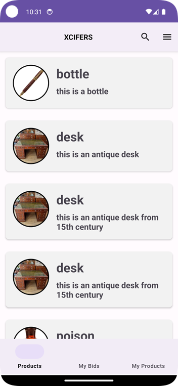
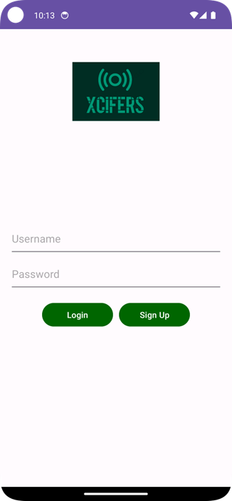
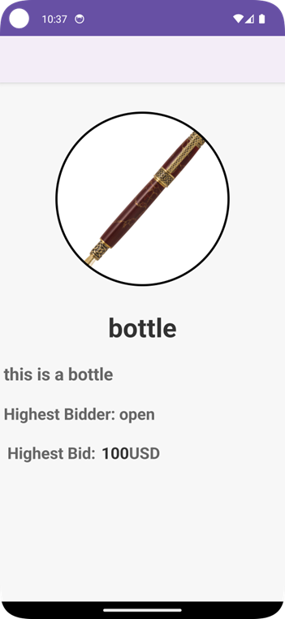

<h1>XCIFERS</h1>

 This is my native android project while i developed as my college project. This project uses XML for front end, Java for back end, and Firebase as database

<h2>Home Page</h2>

<h2>LoginPage</h2>

<h2>Insert Details</h2>

<h2>Product Details</h2>

